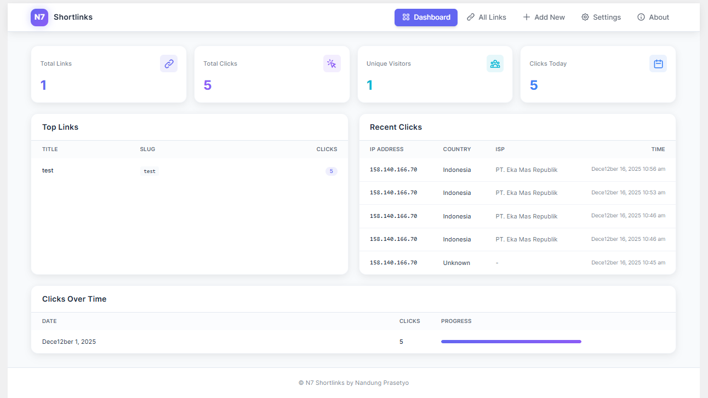
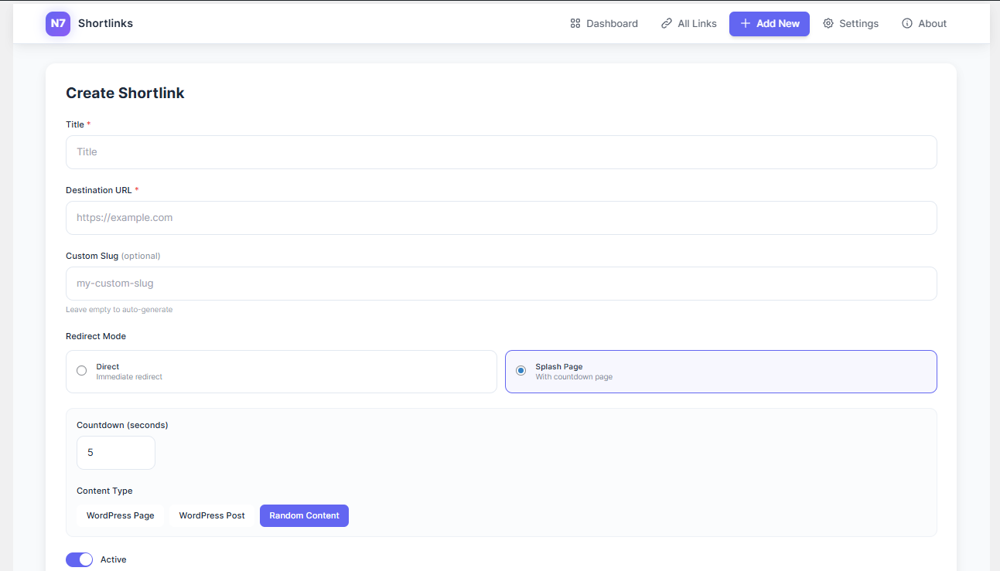
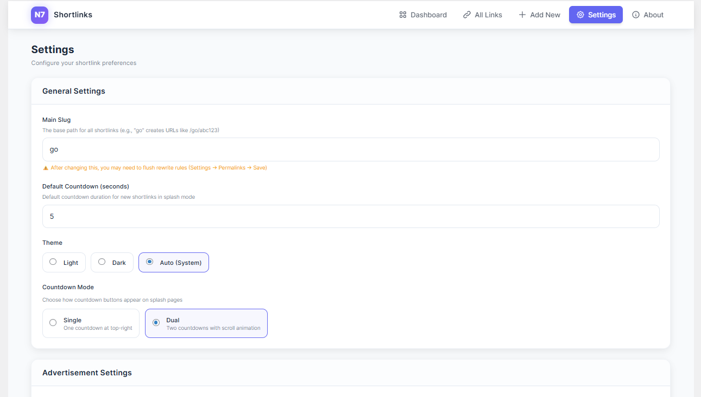
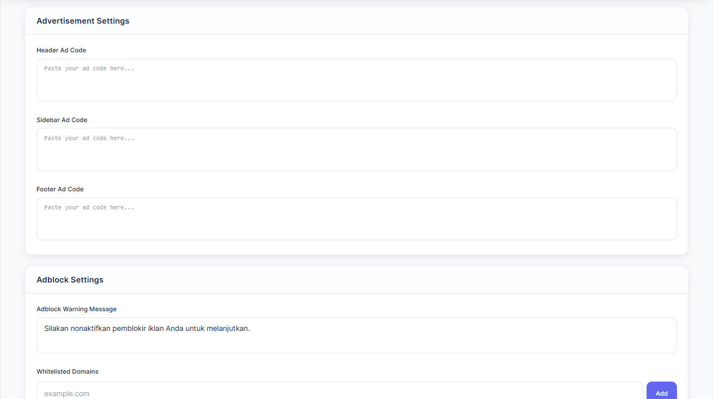

# N7 Shortlinks


**Plugin manajemen shortlink yang aman dengan fitur tracking, statistik, dan splash page untuk WordPress.**

<p align="center">
  <strong>⭐ Jika plugin ini bermanfaat, berikan bintang di GitHub! ⭐</strong>
</p>

---

## 📋 Daftar Isi

- [Tentang Plugin](#-tentang-plugin)
- [Fitur Utama](#-fitur-utama)
- [Persyaratan Sistem](#-persyaratan-sistem)
- [Instalasi](#-instalasi)
- [Panduan Penggunaan](#-panduan-penggunaan)
  - [Membuat Shortlink Baru](#membuat-shortlink-baru)
  - [Mode Redirect](#mode-redirect)
  - [Splash Page](#splash-page)
  - [Statistik & Tracking](#statistik--tracking)
  - [Pengaturan Global](#pengaturan-global)
- [FAQ (Pertanyaan Umum)](#-faq-pertanyaan-umum)
- [Troubleshooting](#-troubleshooting)
- [Changelog](#-changelog)
- [Dukungan](#-dukungan)
- [Lisensi](#-lisensi)

---

## 🎯 Tentang Plugin

**N7 Shortlinks** adalah plugin WordPress yang memungkinkan Anda membuat dan mengelola shortlink dengan mudah. Plugin ini cocok untuk:

- **Blogger** yang ingin memperpendek URL affiliate
- **Pemilik website** yang ingin tracking klik pada link
- **Publisher** yang ingin menampilkan iklan di splash page sebelum redirect
- **Marketer** yang membutuhkan statistik lengkap tentang pengunjung

---

## 📸 Screenshots

### Dashboard



### Membuat Shortlink



### Pengaturan





## ✨ Fitur Utama

### 🔗 Manajemen Shortlink
- **Slug Kustom**: Buat shortlink yang mudah diingat dengan slug pilihan Anda
- **Slug Otomatis**: Slug acak 6 karakter untuk pembuatan cepat
- **Validasi Slug**: Pengecekan ketersediaan secara real-time
- **Redirect SEO-Friendly**: Redirect 301 otomatis saat mengubah slug
- **Konfigurasi Main Slug**: Sesuaikan path dasar (default: `/go/`)
- **Operasi Bulk**: Edit, hapus, atau toggle beberapa link sekaligus
- **Pencarian & Filter**: Cari link berdasarkan slug, judul, atau URL tujuan
- **Toggle Aktif/Nonaktif**: Nonaktifkan link tanpa menghapus

### 🚀 Mode Redirect
- **Direct Mode**: Redirect 302 langsung ke URL tujuan
- **Splash Mode**: Halaman countdown dengan peluang monetisasi
  - Tampilkan halaman/post WordPress sebagai konten splash
  - Pemilihan konten acak dari pool yang dikonfigurasi
  - Injeksi overlay pada konten WordPress yang ada

### 📊 Statistik & Tracking
- **Metrik Klik**: Total klik, pengunjung unik (berbasis IP)
- **Data Geografis**: Negara, kode negara, kota, ISP via API IPInfo.io
- **Analitik Perangkat**: Deteksi browser, OS, tipe perangkat
- **Analisis Berbasis Waktu**: Tren klik harian, mingguan, bulanan
- **Pelacakan Referrer**: Lihat dari mana pengunjung berasal
- **Insight Dashboard**: Link teratas, klik terbaru, grafik visual
- **Fokus Privasi**: Alamat IP di-hash untuk penghitungan pengunjung unik

### 🎨 Splash Page
- **Mode Countdown Ganda**:
  - **Single**: Countdown di pojok kanan atas saja
  - **Dual**: Countdown kanan atas + footer dengan animasi scroll
- **Timer Kustomisasi**: Durasi countdown 0-60 detik
- **Dukungan Tema**: Auto (preferensi sistem), Light, atau Dark mode
- **Monetisasi Iklan**: Slot iklan header, sidebar, dan footer
- **Deteksi AdBlock**: Notifikasi untuk pengguna dengan ad blocker
- **Integrasi Konten**: Tampilkan konten halaman/post WordPress apapun
- **Keamanan Berbasis Token**: Token terbatas waktu mencegah bypass
- **Desain Responsif**: Splash page dioptimalkan untuk mobile

### 🛡️ Keamanan
- **Validasi URL**: Cegah URL tujuan yang berbahaya
- **Sanitasi Input**: Semua input dibersihkan dengan fungsi WordPress
- **Escaping Output**: Perlindungan XSS pada semua data yang di-render
- **Verifikasi Nonce**: Perlindungan CSRF pada operasi yang mengubah state
- **Validasi Token**: Token HMAC-signed untuk redirect splash page
- **Pengecekan Capability**: Kontrol akses berbasis role (`manage_options`)
- **Pencegahan SQL Injection**: Prepared statement untuk semua query
- **Privasi IP**: Hashing SHA-256 untuk alamat IP pengunjung

### 🌐 Internasionalisasi
- **Siap Multi-Bahasa**: Dukungan terjemahan penuh
- **Terjemahan Tersedia**: English, Indonesian (Bahasa Indonesia)
- **Text Domain**: `n7-shortlinks`
- **Dukungan RTL**: Kompatibilitas bahasa kanan-ke-kiri
- **Admin & Frontend**: Dashboard dan splash page dapat diterjemahkan

---

## 💻 Persyaratan Sistem

| Komponen | Versi Minimum |
|----------|---------------|
| WordPress | 5.0 atau lebih tinggi |
| PHP | 7.4 atau lebih tinggi |
| MySQL | 5.6 atau lebih tinggi |

---

## 📥 Instalasi

### Metode 1: Upload via Dashboard WordPress (Direkomendasikan)

1. Download file `n7-shortlinks-x.x.x.zip` dari [halaman Release](https://github.com/nandung-id/n7-shortlinks/releases)
2. Login ke dashboard WordPress Anda
3. Pergi ke **Plugins → Add New → Upload Plugin**
4. Klik **Choose File** dan pilih file ZIP yang sudah didownload
5. Klik **Install Now**
6. Setelah instalasi selesai, klik **Activate Plugin**

### Metode 2: Upload Manual via FTP

1. Download file `n7-shortlinks-x.x.x.zip` dari [halaman Release](https://github.com/nandung-id/n7-shortlinks/releases)
2. Extract file ZIP di komputer Anda
3. Upload folder `n7-shortlinks` ke `/wp-content/plugins/` menggunakan FTP
4. Login ke dashboard WordPress
5. Pergi ke **Plugins** dan aktifkan **N7 Shortlinks**

---

## 📖 Panduan Penggunaan

### Membuat Shortlink Baru

1. Pergi ke menu **N7 Shortlinks** di dashboard WordPress
2. Klik tombol **Add New** atau **Tambah Baru**
3. Isi form dengan informasi berikut:

| Field | Deskripsi | Contoh |
|-------|-----------|--------|
| **Title** | Judul untuk identifikasi (opsional) | "Link Affiliate Tokopedia" |
| **Destination URL** | URL tujuan yang akan di-redirect | `https://tokopedia.com/product/123` |
| **Slug** | Kode pendek untuk URL (auto-generate jika kosong) | `toko123` |
| **Mode** | Pilih Direct atau Splash | Direct |
| **Status** | Aktif atau Nonaktif | Aktif |

4. Klik **Save** atau **Simpan**
5. Shortlink Anda siap digunakan: `https://website-anda.com/toko123`

### Mode Redirect

#### Direct Mode
Pengunjung akan langsung diarahkan ke URL tujuan tanpa halaman perantara.

**Kapan menggunakan:**
- Link yang tidak memerlukan monetisasi
- Link internal website
- Link yang membutuhkan redirect cepat

#### Splash Mode
Pengunjung akan melihat halaman splash dengan countdown sebelum diarahkan ke URL tujuan.

**Kapan menggunakan:**
- Link affiliate yang ingin dimonetisasi dengan iklan
- Link download yang memerlukan konfirmasi
- Link yang ingin ditampilkan informasi tambahan

### Splash Page

Ketika menggunakan **Splash Mode**, Anda dapat mengkustomisasi:

#### Countdown Timer
- Atur durasi countdown (0-60 detik)
- Nilai 0 berarti redirect langsung (sama seperti direct mode)
- Rekomendasi: 5-10 detik untuk keseimbangan UX dan monetisasi

#### Konten Splash
Pilih sumber konten yang akan ditampilkan:

| Tipe | Deskripsi |
|------|-----------|
| **Page** | Tampilkan konten dari halaman WordPress |
| **Post** | Tampilkan konten dari post WordPress |
| **Random** | Tampilkan konten acak dari daftar yang dipilih |

#### Slot Iklan
Anda dapat menempatkan kode iklan di tiga lokasi:
- **Header**: Di bagian atas halaman
- **Sidebar**: Di samping konten
- **Footer**: Di bagian bawah halaman

### Statistik & Tracking

Plugin ini secara otomatis melacak setiap klik pada shortlink Anda.

#### Informasi yang Dilacak:
- Jumlah total klik
- Waktu klik
- User agent (browser & device)
- IP address (untuk analisis lokasi)
- Referrer (dari mana pengunjung datang)

#### Melihat Statistik:
1. Pergi ke menu **N7 Shortlinks**
2. Klik pada shortlink yang ingin dilihat statistiknya
3. Tab **Statistics** akan menampilkan data lengkap

### Pengaturan Global

Akses pengaturan global melalui **N7 Shortlinks → Settings**:

#### Main Slug
- Sesuaikan path dasar untuk semua shortlink (default: `go`)
- Contoh: Ubah dari `/go/abc123` menjadi `/link/abc123`
- **Penting**: Setelah mengubah, flush permalink (Settings → Permalinks → Save)
- **Perlindungan SEO**: Opsi untuk membuat redirect 301 untuk semua link yang ada

#### Default Countdown
Atur durasi countdown default (0-60 detik) untuk shortlink baru dengan mode splash.

#### Mode Countdown
Pilih bagaimana tombol countdown ditampilkan:
- **Single**: Satu countdown di pojok kanan atas
- **Dual**: Countdown kanan atas + footer dengan animasi scroll

#### Theme
Pilih tema untuk splash page:
- **Auto**: Mengikuti preferensi sistem pengunjung (light/dark)
- **Light**: Selalu tampilkan tema terang
- **Dark**: Selalu tampilkan tema gelap

#### Ad Codes
Masukkan kode iklan (Google AdSense, Media.net, dll) untuk monetisasi:
- **Header Ad**: Penempatan banner di atas konten
- **Sidebar Ad**: Iklan vertikal di samping konten
- **Footer Ad**: Penempatan banner di bawah konten
- Mendukung injeksi HTML/JavaScript

#### Pengaturan AdBlock
- **Pesan Peringatan**: Pesan kustom untuk pengguna ad blocker
- **Domain Whitelist**: Domain yang dikecualikan dari deteksi ad blocker

#### Pengaturan Tracking
- **Token API IPInfo.io**: Aktifkan geolokasi sisi server
  - Dapatkan token gratis di [ipinfo.io](https://ipinfo.io)
  - Menyediakan data negara, kota, ISP
  - Hasil di-cache selama 24 jam untuk menghemat kuota API

---

## ❓ FAQ (Pertanyaan Umum)

### Apakah plugin ini gratis?
Ya, N7 Shortlinks adalah plugin gratis.

### Apakah plugin ini kompatibel dengan tema saya?
Ya, plugin ini bekerja dengan semua tema WordPress yang mengikuti standar WordPress.

### Berapa banyak shortlink yang bisa dibuat?
Tidak ada batasan jumlah shortlink yang dapat Anda buat.

### Apakah data statistik akan hilang jika plugin dinonaktifkan?
Tidak, data disimpan di database WordPress dan akan tetap ada meskipun plugin dinonaktifkan. Data hanya akan dihapus jika Anda menghapus (delete) plugin.

### Bagaimana cara mengubah slug shortlink?
1. Pergi ke daftar shortlink
2. Klik **Edit** pada shortlink yang ingin diubah
3. Ubah field **Slug**
4. Pilih opsi redirect SEO:
   - **Create 301 Redirect** (Direkomendasikan): Slug lama otomatis redirect ke slug baru
   - **Delete Old Slug**: Slug lama mengembalikan error 404
5. Klik **Save**

> 💡 **Tips**: Menggunakan redirect 301 mempertahankan nilai SEO dan mencegah broken link!

### Apakah plugin ini mendukung redirect 301?
Ya! Plugin ini mendukung keduanya:
- **Redirect 302**: Digunakan untuk redirect shortlink aktual (temporary, cocok untuk tujuan yang berubah)
- **Redirect 301**: Digunakan untuk SEO saat mengubah slug (permanent, mempertahankan link juice)

Ketika Anda mengubah slug shortlink, Anda dapat membuat redirect 301 dari slug lama ke yang baru.

### Bagaimana cara memasang iklan di splash page?
1. Pergi ke **N7 Shortlinks → Settings**
2. Scroll ke bagian **Ad Codes**
3. Paste kode iklan Anda (Google AdSense, dll) di slot yang diinginkan
4. Klik **Save**

### Apakah plugin ini mempengaruhi SEO?
Tidak, shortlink menggunakan redirect 302 yang tidak mempengaruhi SEO website Anda.

---

## 🔧 Troubleshooting

### Shortlink tidak berfungsi (404 Error)

**Penyebab umum:**
1. Permalink WordPress tidak dikonfigurasi dengan benar
2. File `.htaccess` tidak dapat ditulis

**Solusi:**
1. Pergi ke **Settings → Permalinks**
2. Klik **Save Changes** (tanpa mengubah apapun)
3. Coba akses shortlink lagi

### Splash page tidak menampilkan iklan

**Penyebab umum:**
1. Kode iklan tidak valid
2. Ad blocker aktif di browser

**Solusi:**
1. Pastikan kode iklan sudah benar
2. Nonaktifkan ad blocker untuk testing
3. Periksa console browser untuk error JavaScript

### Statistik tidak terekam

**Penyebab umum:**
1. Caching plugin terlalu agresif
2. CDN meng-cache halaman redirect

**Solusi:**
1. Exclude URL shortlink dari cache
2. Tambahkan rule di CDN untuk bypass shortlink

### Plugin konflik dengan plugin lain

**Solusi:**
1. Nonaktifkan plugin lain satu per satu untuk menemukan konflik
2. Hubungi support dengan informasi plugin yang konflik

---

## 📝 Changelog

### Version 0.1.0 (Initial Release)
- ✅ Manajemen shortlink dengan operasi CRUD
- ✅ Mode redirect Direct (302) dan Splash
- ✅ Mode countdown ganda (single/dual dengan animasi scroll)
- ✅ Statistik klik dan analitik komprehensif
- ✅ Pelacakan geografis dengan integrasi API IPInfo.io
- ✅ Deteksi perangkat, browser, dan OS
- ✅ Redirect 301 SEO-friendly untuk perubahan slug
- ✅ Konfigurasi main slug dengan dukungan bulk redirect
- ✅ Slot monetisasi iklan (header, sidebar, footer)
- ✅ Deteksi AdBlock dan whitelisting
- ✅ Dukungan tema auto/light/dark
- ✅ Integrasi konten WordPress untuk splash page
- ✅ Sistem injeksi overlay untuk konten yang ada
- ✅ Keamanan berbasis token untuk redirect splash
- ✅ REST API dengan endpoint CRUD lengkap
- ✅ Dashboard admin React + TypeScript
- ✅ Aplikasi splash page React + TypeScript
- ✅ Dukungan multi-bahasa (English, Indonesian)
- ✅ Sistem upgrade database untuk migrasi schema

---

## 💬 Dukungan

Jika Anda mengalami masalah atau memiliki pertanyaan:

1. **GitHub Issues**: [Buat issue baru](https://github.com/nandung-id/n7-shortlinks/issues)
2. **Email**: Hubungi developer melalui [nandung.id](https://nandung.id)

### Sebelum Menghubungi Support

Pastikan Anda menyertakan informasi berikut:
- Versi WordPress
- Versi PHP
- Versi plugin N7 Shortlinks
- Deskripsi masalah yang jelas
- Screenshot jika ada

---

## 📄 Lisensi

N7 Shortlinks dilisensikan di bawah [GPL-2.0 License](https://www.gnu.org/licenses/gpl-2.0.html).

```
Copyright (C) 2024 Nandung Prasetyo

This program is free software; you can redistribute it and/or modify
it under the terms of the GNU General Public License as published by
the Free Software Foundation; either version 2 of the License, or
(at your option) any later version.

This program is distributed in the hope that it will be useful,
but WITHOUT ANY WARRANTY; without even the implied warranty of
MERCHANTABILITY or FITNESS FOR A PARTICULAR PURPOSE. See the
GNU General Public License for more details.
```

---

## 👨‍💻 Credits

**Developed by:** [Nandung Prasetyo](https://nandung.id)

**Repository:** [github.com/nandung-id/n7-shortlinks](https://github.com/nandung-id/n7-shortlinks)

---
